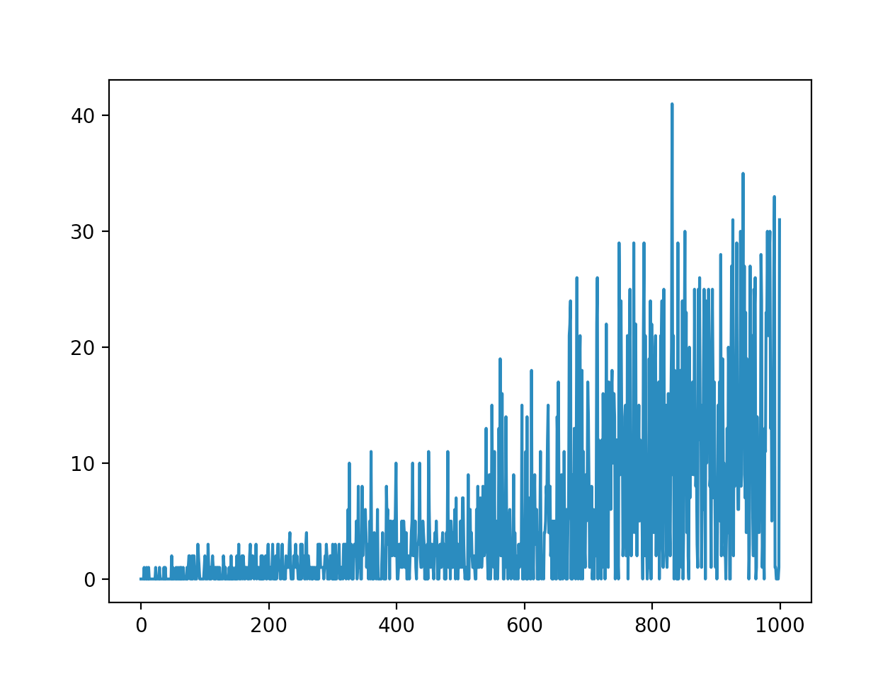

h1. AI plays snake game

Solution using "Double" Deep Reinforcement Learning (Q-learning)

h4. Result 

Repository contains trained network (after 1000 iterations)

h4. Visualisation

h4. Input

1. is wall/tail directly up front
2. is wall/tail directly on the right side
3. is wall/tail directly on the left side
4. is snack ahead (no matter how far)
5. is snack on the right (no matter how far)
6. is snack on the left (no matter how far)

h4. Output

1. do nothing (keep going on current direction)
2. turn right
3. turn left

h4. Reward table:

- +1 for finding snack
- -1 for hitting wall/tail

h4. Network settings:

Param | Value | Info
--- | --- | ---
LEARNING_RATE | 0.001 |
GAMMA | 0.95 | Discount rate
EPSILON | 1.0 | Exploration rate
EPSILON_DECAY | 0.995 |
EPSILON_MIN | 0.01 |
MEMORY | 2000 | Experience replay
MINI_BATCH | 32 |

